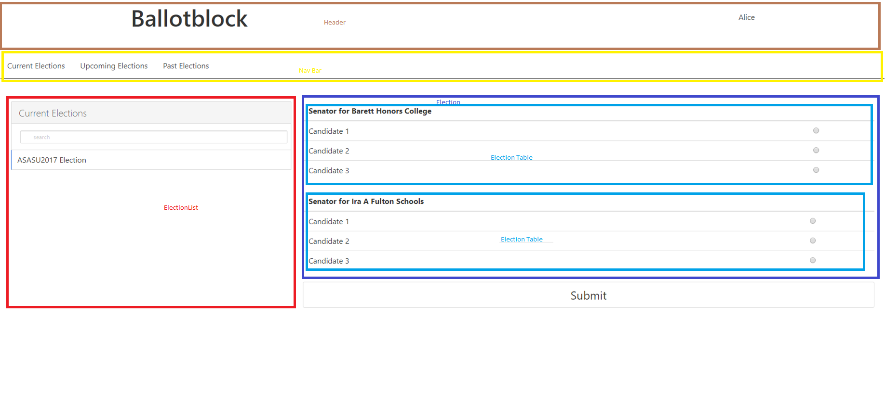

# webapp
Web App / Client for Ballotblock

This application uses the create-react-app tool to generate the initial app. 
For more information on it, https://reactjs.org/ is a website that contains some details. 

There are several npm commands that are useful in testing and deploying. 

1. npm run start - start the web application hosted locally 

2. npm run build - creates a "build file" that can be used for deployment.  The content you would see on the branch "DeployBranch" 
                contains the contents of this file. 
                
3. npm run test - runs all the tests in the test folder. Each component has a separate file mean to test it.
                  As of 4/2/2018 , the tests are not even remotely extensive, they simple test to see if the component renders. 

4. npm install while in the package.json directory would install all the necessary node modules. There might be issues starting the app         locally without first installing the dependencies. 

# Some general information
This application will require javascript enabled on the browser in order for it to work. Requests are being made from several components as this application is connected to the registration and API server.  In testing, these can be commented out and hard coded with data. 

  1. In login.js, there are two methods that send requests to the registration server.  Look at the methods called login and createAccount.
    When a user logs in, a request is sent to the registration server and if sucessful, a cookie is set on the browser. 

  2. In content.js there is a getElections method which recieves a date parameter. It revieves a list of elections based on the date passed in. The data retrieved in only a list of election titles and possibly the organizer as well as start and end date depending on which type(past,current,upcomming) is choosen. Below is an example of the input json. 
  """
  [
    [
      {
        "electionId": "ASASU2017 Election"
      }
    ], 
    200
  ]
  """

  3. In election.js,  in the componentWillReceiveProps method a request is made to retrieve all the details for an election. 
  Here all the propositions, startDate, endDate, and selections if any are retrieved. 

  4. In electionResult.js a request will be made to retrieve all the results for an election.
    As of 4/2/2018 no request is currently being made, its hard coded and has to be added soon. 
    
  5. In organizer.js , a request will probably have to be made to create elections as well. As of 4/2/2018 no request is currently being made, its hard coded and has to be added soon. 

In App.js you will find a list of routes, you can navigate to any of these routes directly by simply inputing them in the url. 

State is shared between all the components by using a cookie in the browser. So in order for this application to work, cookies need to be enabled. 

# Component Hierachy 
- This might be a little outdated but its still pretty relevant

